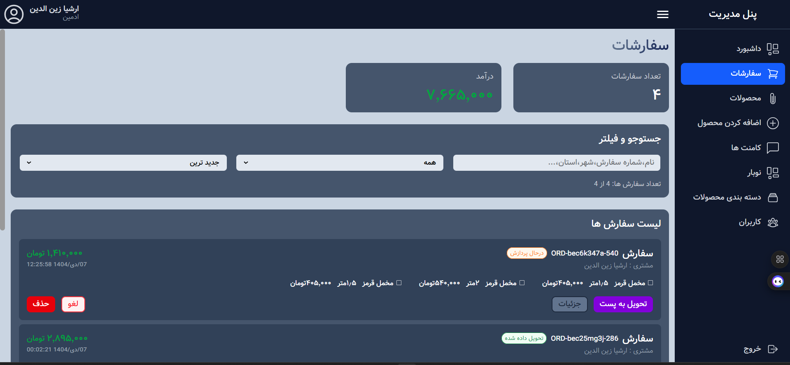

# Fabric admin dashboard
___

>This project ia an admin dashboard related to the [Fabric Sore](https://github.com/zArshiaz/fabric-store) project .
 
`this is imprtent`

### For run project :
Step one : ```npm install```
Step two : ```ng serve```
